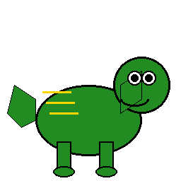

# 🦖 INSTALADOR PREMIUM - JUEGO DINOSAURIO

<div align="center">



## 🚀 INSTALACIÓN SÚPER FÁCIL CON UN SOLO BOTÓN

**¡La forma más fácil de instalar el juego!**

</div>

---

## 🎯 INSTRUCCIONES SÚPER SIMPLES

### 📥 Paso 1: Preparación
1. **Descargar Python** (si no lo tienes):
   - Ve a: https://www.python.org/downloads/
   - Descarga Python 3.8 o superior
   - ⚠️ **IMPORTANTE**: Marca "Add Python to PATH" durante la instalación

### 🚀 Paso 2: Instalación Automática
1. **Haz doble clic en `INSTALAR_PREMIUM.bat`**
2. **Espera a que aparezca la ventana gráfica**
3. **Presiona el botón "INSTALAR TODO AUTOMÁTICAMENTE"**
4. **¡Espera y listo!** ☕

---

## ✨ CARACTERÍSTICAS DEL INSTALADOR PREMIUM

### 🖥️ Interfaz Gráfica Avanzada
- ✅ **Splash Screen** animado al inicio
- ✅ **Pestañas organizadas** (Instalación e Información)
- ✅ **Barra de progreso** en tiempo real
- ✅ **Log colorido** para seguir el proceso
- ✅ **Botones de acción** para diferentes opciones

### 🤖 Instalación Completamente Automática
- ✅ **Verifica Python** automáticamente
- ✅ **Crea entorno virtual** aislado
- ✅ **Instala dependencias** (pygame, mysql-connector)
- ✅ **Instala PyInstaller** para crear ejecutables
- ✅ **Compila el juego** a un .exe independiente
- ✅ **Incluye icono personalizado** del dinosaurio
- ✅ **Manejo de errores** inteligente

### 🎮 Opciones Adicionales
- ✅ **Ejecutar juego** directamente desde el instalador
- ✅ **Abrir carpeta** del proyecto
- ✅ **Solo crear .exe** (para desarrolladores)
- ✅ **Información del sistema** completa

---

## 📋 LO QUE HACE EL INSTALADOR

### 🔧 Proceso Automático (5-10 minutos):

1. **🔍 Verificación del Sistema**
   - Comprueba Python y versión
   - Verifica espacio en disco
   - Detecta sistema operativo

2. **🏗️ Preparación del Entorno**
   - Crea entorno virtual `.venv`
   - Actualiza pip a la última versión
   - Prepara estructura de directorios

3. **📦 Instalación de Dependencias**
   - pygame (motor del juego)
   - mysql-connector-python (base de datos)
   - PyInstaller (crear ejecutables)

4. **🔨 Compilación del Ejecutable**
   - Incluye todas las imágenes y sonidos
   - Agrega icono personalizado del dinosaurio
   - Crea archivo .exe independiente (no necesita Python)

5. **✅ Finalización**
   - Verifica que todo esté correcto
   - Muestra información del ejecutable creado
   - Habilita botón para ejecutar el juego

---

## 📁 ESTRUCTURA DESPUÉS DE LA INSTALACIÓN

```
Proyecto-ProgramacionPy/
├── instalador/
│   ├── INSTALAR_PREMIUM.bat  ← 🎯 EJECUTA ESTO PRIMERO
│   ├── instalador_premium.py ← Instalador gráfico avanzado
│   ├── icon.ico             ← Icono del dinosaurio
│   └── README_PREMIUM.md    ← Este archivo
├── dist/
│   └── JuegoDinosaurio.exe  ← 🎮 TU JUEGO LISTO
├── .venv/                   ← Entorno virtual (auto-creado)
├── scr/                     ← Código fuente
├── img/                     ← Imágenes del juego
├── musica/                  ← Sonidos del juego
└── requirements.txt         ← Dependencias (auto-creado)
```

---

## 🆘 SOLUCIÓN DE PROBLEMAS

### ❌ "Python no está instalado"
**Solución:**
1. Descarga Python desde https://www.python.org/downloads/
2. Durante la instalación, marca "Add Python to PATH"
3. Reinicia el instalador

### ❌ "Error de permisos"
**Solución:**
1. Click derecho en `INSTALAR_PREMIUM.bat`
2. Selecciona "Ejecutar como administrador"

### ❌ "El instalador no abre"
**Solución:**
1. Abre PowerShell en la carpeta
2. Ejecuta: `python instalador_premium.py`

### ❌ "No se puede crear el ejecutable"
**Solución:**
1. Libera espacio en disco (necesitas ~500MB)
2. Cierra antivirus temporalmente
3. Usa el botón "Solo crear .exe" si ya tienes dependencias

### ❌ "El juego no inicia"
**Solución:**
1. Verifica que las carpetas `img/` y `musica/` existan
2. Ejecuta desde el instalador para ver errores detallados

---

## 💡 CONSEJOS PARA MEJORES RESULTADOS

### ⚡ Antes de Instalar:
- ✅ Cierra otros programas pesados
- ✅ Conecta a internet estable
- ✅ Libera al menos 1GB de espacio
- ✅ Desactiva antivirus temporalmente

### 🎮 Después de Instalar:
- ✅ El archivo `JuegoDinosaurio.exe` es independiente
- ✅ Puedes copiarlo a otras computadoras
- ✅ No necesita Python instalado para ejecutarse
- ✅ Funciona en Windows 7, 8, 10 y 11

---

## 🎨 CARACTERÍSTICAS DEL JUEGO

### 🕹️ Controles Mejorados:
- **SPACE**: Saltar
- **DOWN**: Agacharse / Flotación en aire
- **SPACE + DOWN**: Dash aéreo especial

### 🌟 Características Especiales:
- ✅ **Múltiples personajes** seleccionables
- ✅ **Diferentes mundos** temáticos
- ✅ **Efectos de sonido** inmersivos
- ✅ **Sistema de ranking** con base de datos
- ✅ **Mecánicas avanzadas** (dash, flotación)

---

## 👥 CRÉDITOS

**Desarrollado por el Equipo Dinosaurio:**
- Alma Carena
- Facundo Noriega
- Mateo Lugo
- Santino Trevisano
- Severino Bassus

**GitHub:** FacundoTecnica1/Proyecto-ProgramacionPy

---

<div align="center">

## 🦖 ¡DISFRUTA EL JUEGO! 🎮

**¿Listo para la aventura jurásica?**

[🚀 INSTALAR AHORA](INSTALAR_PREMIUM.bat)

</div>